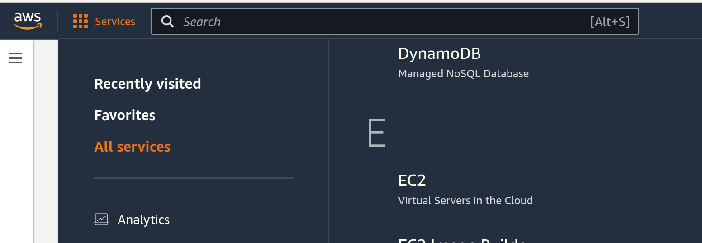
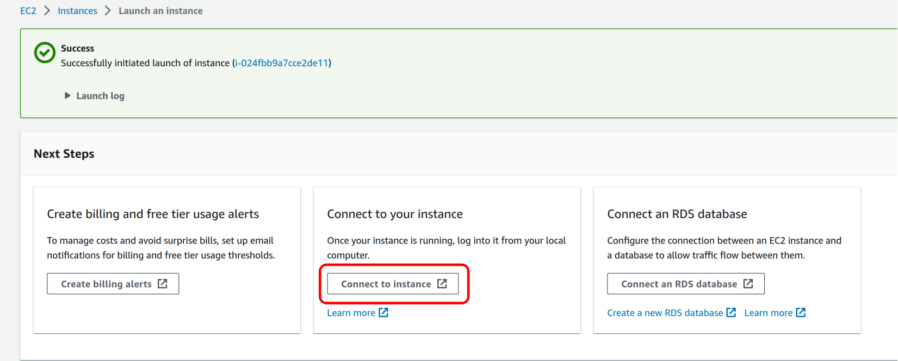
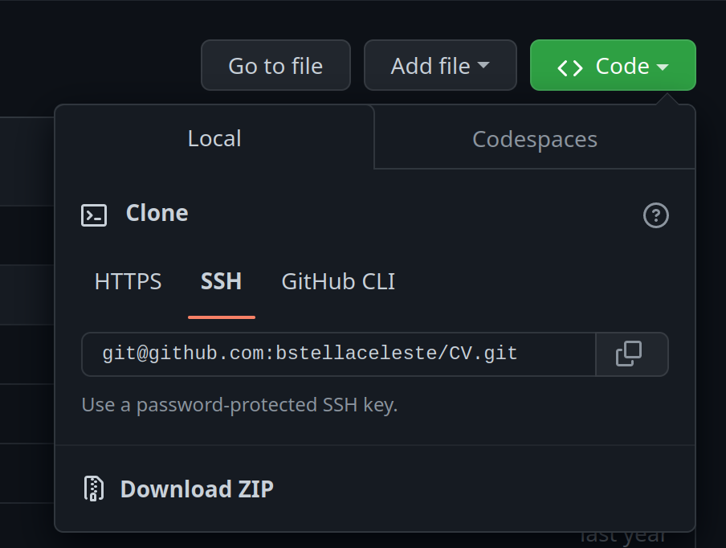

# SCIENCE EVENTS CAMEROON's Tutorial <br> GitAws: GitHub+AWS
#### *December 20 - Polytechnic School of Yaounde, Stella Bitchebe*

# Amazon Web Service (AWS)
[AWS](https://aws.amazon.com/fr/what-is-aws/) is a cloud platform among the most comprehensive and broadly used ones. AWS offers many data center services and allows application providers to securely host their applications.

### Creating an Account 
You can create a free account on the [AWS website](https://portal.aws.amazon.com/billing/signup?WIAWS=tile&tile=hero#/start/email): fill in your user email and name and simply follow the instructions.
Make sure to fill in an available and valid email address, as a verification code will be sent to the latter.

For this tutorial and to allow everyone to efficiently follow the tutorial, we give you temporary access to [Stella's account](https://581028953800.signin.aws.amazon.com/console) (because you need a payment method to create an account). The user name is `ScientificDays22`, and the password is `Tutorials22`


### Launching an Instance
You can create a virtual machine (VM) by launching an instance
1. On the home page, click on "Services" at the top of the page, then "All services" and "EC2", like in the picture below:


<br>

2. This leads you to the EC2 dashboard, where you can have an overview of all your resources. To create a new VM, click on the "Launch instance" button.

<br>

3. Enter a name for your VM, choose the operating system (OS) -*`Linux` for this tutorial*-, the instance type -*choose a free tier instance: by default, `t2.micro` with 1GB RAM and 1vCPU*-, the key pair -*you must have a key pair to enable ssh connection to your instance*-. Choose the `ScientificDays22.pem` key pair created for this tutorial, downloadable [here](resources/ScientificDays22.pem). Everything else can be left at the default config.
<br>

4. On the creation success page, you can directly connect to your newly created instance: 
   
   
   
   Next, follow the instructions on the "SSH client" tab to access your VM from a terminal: 
   
    

# GitHub   
GitHub is a cloud-based Git (a version control system) repository that helps you store, manage, track and control changes to your projects.

### Installation
1. On Linux:
   ```
   sudo apt update
   sudo apt install git-all
   ```
<br>

2. On Windows: 
   
   * Download the [windows installer](https://github.com/git-for-windows/git/releases/download/v2.39.0.windows.1/Git-2.39.0-64-bit.exe) that we make available [here](resources/Git-2.39.0-64-bit.exe)
   
   * At the 'PATH environment' installation phase, choose *Git from the command line and also from 3rd party software* ==> this will provide a git bash terminal that understands all git commands. 

### Account Creation

Creating a GitHub account is simple. Just [sign up](https://github.com/signup?ref_cta=Sign+up&ref_loc=header+logged+out&ref_page=%2F&source=header-home) and follow the steps (enter a valid and accessible email address, a user name, and a password).

# Gitaws
1. Create a new repository in your GitHub account (by clicking on `new` like in the following picture):

    Fill in the name and the description and click on `Create repository` at the bottom of the page: you will be provided with a list of commands to link your local *code/project* to the newly created repo.
<br>

2. On your laptop, choose a project that you would like to save in the cloud, move to the corresponding directory, and type:
    ```
    echo "# xxxx" >> README.md
    git init
    git add README.md
    git commit -m "first commit"
    git branch -M main
    git remote add origin git@github.com:xxxx (the link of your repo)
    git push -u origin main
    ```
    At the end, reload your git page and your project should be available.
<br>

3. Now, move back to your AWS' VM to clone your repo.
   Before cloning, you must establish the ssh connection with your laptop and your VM. Click on the profile's button at the top right and go to `settings` -> `ssh and GPG keys` -> `new SSH key`. Give a name to your key and enter the public key of your device. 
   Open a terminal (on Linux or the Git bash terminal on Windows) and first generate an ssh key (if you don't yet have one): `ssh-keygen`. 
   > You can leave all the answer's fields blank, and at the end, the tool will print the path to your public key (generally at `$HOME/.ssh/id_rsa.pub`)
   
   Once your keys are generated, print the public one: `cat path/to/your/id_rsa.pub` and copy it to your GitHub account settings.

   You can now clone your repo both in your VM and your laptop. Copy the link as in the picture below, and in a terminal, type:

   

4. In your VM, make some changes to your project and upload them:
   ```
   git status (to know which files have been modified and need to be saved)
   git add xxx (xxx is for the files you want to save; you can replace xxx by '.' to include everything)
   git commit -m "a message that informs about the backup"
   git push (to upload the files to save)
   ```
   If you refresh the GitHub page, you can see your changes.
<br>

5. Now, go to your laptop and browse your files: obviously, you still have the previous version of your project, i.e., the changes made from your VM are not visible on your laptop. To have the same version as your VM (and the remote one), you need to `pull` the changes: `git pull`.
<br>

6. Let us simulate a failure i.e., you *accidentally* delete your directory in one or both machines (your VM or your laptop). If you do so, recovery is as simple as just re-cloning the project, like in **step 3**.
<br>

7. Let us now imagine that you pushed something you didn't want to. Don't panic! You can revert to the previous commit like this: `git reset --soft HEAD~`. This will move your project (remote) to the version before the unfortunate commit.
    > A '**--hard**' reset will also move your local files to the previous version. 

    